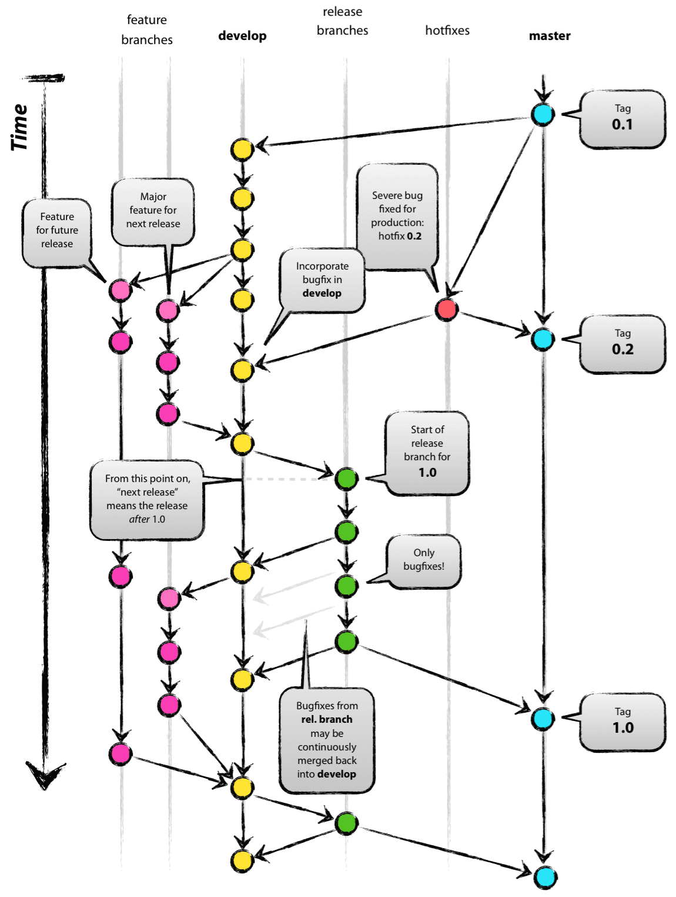

# Contributions

We welcome contributions to the project.  Please read the following guidelines before submitting a pull request or issue.

Please note, this guide is more conceptual and meant to be universal for whatever tools you use to develop.

## Explanation of Project structure

The project structure in this repository may look daunting at a glance, however, it's to try and give maintainers a better experience.

1. `src` contains the project's source code
2. `tests` contains all of the project's Jest tests & their appropriate fixtures.
3. `scripts` does not contain any too important to the project. Just used for Gitpod, which I doubt many contributors would be interested in.

### Files & Configurations

This project uses Husky & Commitlint & Lint-staged to provide developers with a safety net on their own machine.

**IMPORTANT**: One feature *per* PR. One bug fix *per* PR. One refactor *per* PR.

These all integrate into ESLint, Jest, and Prettier.

If you're not familiar with these tools, here's a quick explanation:

1. Husky runs scripts on commit or possibly on-push. Ex, we use it to run `lint-staged` on the `pre-commit` hook.
2. Lint-staged runs scripts on staged files. Runs validation on staged files.
3. Commitlint enforces the [conventional commit message standards](https://www.conventionalcommits.org/en/v1.0.0/#specification).
4. ESLint enforces code style standards. We use it to enforce our project's styling.
5. Jest tests your code.
6. Prettier formats code.
7. TypeScript allows you to create type-safe code. We then compile it to JavaScript.
8. NCC compiles TypeScript code into a single JavaScript file. We need this to provide a single *bundled* JavaScript file for GitHub Actions.

Want to skip verification of the validity of your code? Use `git commit` with the `--no-verify` flag to skip commit hook.
However, don't be surprised if the CI fails your PR.

If you think of yourself as all wise and powerful, you can disable these tools by removing the appropriate configuration files.
Just make sure you don't commit any code that doesn't follow the project's standards & do not commit the removed configuration files to the project.

## Pull Requests

Please, go through these steps before you submit a PR.

* Make sure your PR is not a duplicate.
* Your pull request MUST NOT target the `master` branch on this repository. You want to target `next` instead.
* Make sure you have read the [Code of Conduct](https://www.contributor-covenant.org/version/2/0/code_of_conduct/).
* Please submit pull requests against the `next` branch.
* Include a description of the change and include the relevant issue number that
the pull request fixes.
* Please include tests for the change.
* Please run `pnpm test` to ensure that the tests pass.
* Run `pnpm lint && pnpm format` to ensure that your code is formatted correctly.
* Please make sure all commits follow the [commit message standard we use]([#commit-message-guidelines](https://www.conventionalcommits.org/en/v1.0.0/#specification)).
* Please make sure your pull request's title follows the commit message conventions as well.

Finally, make sure to follow the branch conventions below.

Remember, in the diagram below, `next` is considered the `develop` branch.

Optionally, you can read more about it here <https://nvie.com/posts/a-successful-git-branching-model/>, also credit to nvie for the diagram.
